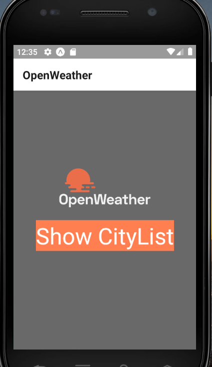
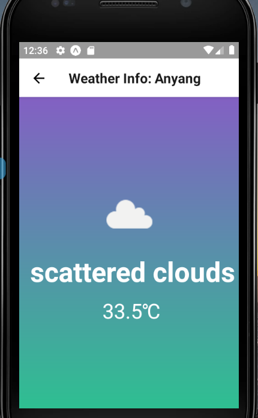

# 실전코딩 2조 Weather-App 과제 

## 조원
이안규, 원동욱, 최진영, 최지원, 김도연 

총 5명

### 추가 구현 내용
- StartScreen : 기존 바로 도시목록을 보여주던 화면에서 대기화면의 Show CityList를 클릭해야 
도시목록을 보여주는 화면으로 변경
- WeatherDetailScreen : openweathermap api의 icon변수의 값을 이용하여 
openweathermap에서 변수의 값과 
맞는 날씨 아이콘과 날씨상태 온도를 보여주는 화면으로 변경
## 추가 구현 화면 예시
- StartScreen



- WeatherDetailScreen



## 추가 구현 코드예시
- StartScreen

```javascript
//StartScreen.js

export default class StartScreen extends React.Component{

    static navigationOptions = {
        title: 'OpenWeather',
    };

    render() {
    
        const {navigation} = this.props;
        return (
            <View style={styles.container}>
                        <View style={styles.top}>
                            <Image style={{ height: '50%', width: '50%', resizeMode: 'contain'}}
                                source={require('./weather-logo/logo.png')} />
                        </View>
                        <View style={styles.bottom}>
                            <TouchableOpacity style={{backgroundColor: 'coral'}}
                                onPress={() => {
                                navigation.navigate("CityList")
                                }}>
                                <Text style={styles.text}>Show CityList</Text>
                            </TouchableOpacity>
                        </View>
             </View>
        );
    }
}

```
- WeatherDetailScreen

openweathermap api의 icon 변수의 값을 기준으로 화면을 리턴하도록 swtich문을 구성했습니다.
```javascript
//WeatherDetailScreen.js

switch (icon) {
            case "01d":
                return (
                    <LinearGradient
                        colors={['#8360c3', '#2ebf91']}
                        style={styles.bg}>
                        <View style={styles.top}>
                            <Image style={{ height: '50%', width: '50%', resizeMode: 'contain' }}
                                source={require('./weather-icon/01d.png')} />
                        </View>
                        <View style={styles.bottom}>
                            <Text style={styles.main}> {description}</Text>
                            <Text style={styles.temp}> {celsius.toFixed(1)}℃</Text>
                        </View>
                    </LinearGradient>
                );
                .....

```

